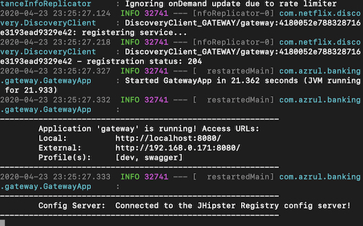
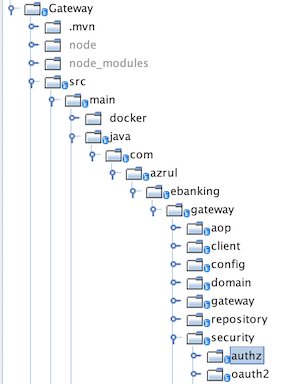

Managing Keycloak authorisation through Zuul
============================================

By Azrul MADISA

April 2020

 

Introduction
------------

Before micro-services, we tend to mix together different aspects of our software
and systems. It is not uncommon to have a monolith component managing
authentication, authorisation and business logic all in one place. This tight
coupling would make it difficult for a particular business logic to be used
‘outside’ of the corresponding authentication and authorisation scheme - and
therefore makes it less reusable.

In the micro-services world, we would like to propose pushing authentication and
authorisation to the Gateway layer. Basically, authorisation is checked even
before a request hits a service. This means that, a service would be more
‘context-neutral’ when in comes to authentication and authorisation. It also
means that I could easily deploy a service under a Gateway and manage its
authentication and authorisation separately at runtime. This would amplify
reusability across the board.

This also creates a self governing platform for authentication and
authorisation. No more would a business user need to create a user story or file
a change request to update authentication and authorisation configuration.

 

 

### Authorisation vs. Authentication

**Authentication** is verifying if you have the right credentials. For example,
it verifies that your username matches your password.

 

**Authorisation** is verifying if you can what you intent to do. For example,
you are allowed to edit certain data and delete certain others.

 

In this tutorial we will mainly focus on Authorisation using Keycloak. We have
already addressed Authentication as part of our earlier tutorial here
[<https://github.com/azrulhasni/Ebanking-JHipster-Keycloak-Nginx-K8>]. We will
also use that tutorial as the basis, i.e. we will not repeat some of the
instructions that was already clarified before (e.g. how to deploy Keycloak to
Kubernetes)

 

### Authorisation logic vs. Business Logic - a discussion

Let us say that we are building an application for a bank. It is being used by
both bank customers directly through some ebanking portal and it is being used
by bank tellers in bank branches. We will have 2 types of users: bank customers
and bank tellers. Let us also say that we have a resource called product-account
representing your typical account in the bank (e.g.deposit account). What kind
of access controls should there be on this resource? And where do we implement
those access controls?

 

Well, we could say that a customer should be able to read or view
product-account - e.g. to know what is its balance. The bank teller should also
be able to view a product-account - as customer could walk into a branch and
query the bank teller for her balance. A bank teller could create a new
product-account since a customer can come to the branch and register. But, a
customer may not be able to create a product-account on his own. He would need
to come to branch and get his ID card checked out etc. We definitely do not want
some money launderer to open a bank account. (we call this step KYC - or Know
Your Customer - it is a compliance check that exist in many countries, but many
others may not have it). Let us summarise the mapping between roles, resource
and rights of our application:

 

| **Role**      | **Resource**    | **Rights**           |
|---------------|-----------------|----------------------|
| Bank Teller   | product-account | View, Create, Update |
| Bank Customer | product-account | View, Update         |

Now, here is a problem. When we say a bank customer can view product-account, he
can actually view any product-account, even if the product-account is not his
own. The same thing with update. Of course that should not be true. A bank
customer should only be able to see and update her own account only. We might
say that the solution is obvious: create two more rights, Update-Own or
View-Own. The problem is, determining product-account ownership is going beyond
‘authorisation’. This brings us to our rule of thumb.

 

>   **The moment our authorisation logic would need the knowledge of the
>   underlying domain (e.g. product-account, or airline ticket, or movie
>   booking, or shopping cart, or treasury deals etc.), such logic should reside
>   with the business logic and not authorisation logic.**

 

It actually make sense: the reason why we separate authorisation and business
logic is so that the business logic could be used in some other authorisation
context. But business rules, such as a customer can only see his own account,
will stay true no matter what context it is. These business rules should reside
with its corresponding service.

 

 

 

 

The plan
--------

### Directory structure

Let us say that we have a directory where we put all our projects. Let us call
that directory \$PROJECTS. Our propose directory structure would be:

 

\$PROJECTS

\|—ebanking

\|--\|— banking

\|--\|— gateway

\|—\|— central-config

 

 

### The flow

The flow we are implementing is as below. It looks like a classic OAuth2
Resource Owner Password Grant with little twist: just before the Gateway passes
the call to our banking micro-service, it will call Keycloak to evaluate the
permission that a particular user has. Depending on that permission, we will
allow or not the access to the banking micro-service.

 

Note: we use Resource Owner Password Grant for simplicity sake of this tutorial.
The techniques here can be applied to any type of grant where we have access to
the access token.

 

Setting up Keycloak authorisation
---------------------------------

### Authorisation with Keycloak

Here, we will talk about the concept of authorisation of Keycloak based on our
implementation. Note that Keycloak has a very extensive and flexible
authorisation framework - we will not cover the whole sleuth of that here. We
will focus on how we are using it. For further reading please see [

<https://www.keycloak.org/docs/latest/authorization_services/>]

Keycloak has the concept of a User having multiple Roles. (Roles can also be
owned by multiple Users, but for simplicity sake, we will not focus on that).
Each role can be associated with a Policy. We can think of Policy as the entry
point of Roles into Keycloak’s authorisation scheme.

 

Resource represents something that access is controlled. We are going to use
“restful” format to annotate resource (such as /api/product-account). This will
facilitate the mapping between the incoming request with the resource
represented in Keycloak.

 

A scope represents actions to be done on a resource - such as read or create.

 

A permission ties all these concept together. In our example, a “Customer can
View and Update Product-Account” permission would tie the ROLE_CUSTOMER role
(representing customer, through the CUSTOMER_POLICY) with a resource called
/api/product-account and the scope is View.

### The steps

-   Download Keycloak [<https://www.keycloak.org/downloads.html>], unzip it /
    untar it under \$PROJECTS/ebanking/keycloak

-   Follow the tutorial here to get Keycloak up and running
    <https://www.keycloak.org/getting-started/getting-started-zip>

    -   Create a realm called ebanking

    -   Create a client called ebankingclient

    -   Make sure to note the secret of the client. This will be used later on
        when setting up micro-services

-   Create 2 roles (under Realm Roles) : ROLE_BANK_TELLER representing bank
    officers and ROLE_CUSTOMER representing bank customers

-   Create 2 users: donald.duck - with the rolle ROLE_CUSTOMER and minnie.mouse
    with the role ROLE_BANK_TELLER. Below is the role mapping for donald.duck
    and minnie.mouse.

-   Next, under the EbankingClient page, turn on authorisation, go to the Bottom
    of the page and click Save.

-   A new tab called Authorization will appear. Click on that tab

-   Firstly, in the Authorization \> Settings tab, set the Decision Strategy to
    Affirmative. This would mean that permission is given if approval is
    obtained from any **one** permission.

-   Then, select the Authorization Scopes tab and create 4 scopes with names :
    CREATE, DELETE, UPDATE and VIEW.

-   Then select Resources tab and create a resource called /api/product-accounts
    as per below. Make sure the field ‘Scopes' has all four authorisation scopes
    created above.

-   Next, go to the Policy tab and create BANK_TELLER_POLICY and
    CUSTOMER_POLICY. Create these under the Policy of type Role.

-   Make sure to attach ROLE_BANK_TELLER and ROLE_CUSTOMER to the
    BANK_TELLER_POLICY and CUSTOMER_POLICY respectively.

-   Next, go to the Permission tab, and create a permission of type Scope

-   Create two permissions:

    -   ‘Customer can View and Update Product-Account’

    -   ‘Bank-Teller can View and Update Product-Account’

-   We should have the two permissions below:

### Testing the authorisation scheme

-   To test, go to the Evaluate tab. Fill in the user (donald.duck). Choose a
    resource (/api/product-accounts) and a scope (VIEW) and click on the Add
    button. To evaluate click on Evaluate.

 

-   The result will be as follows:

-   You can clearly see that, since donald.duck is a customer, the 'Bank Teller
    can Create View, and Update Product-Account’ permission voted to deny any
    scope.

    -   The permission 'Customer can View and Update Product-Account’ due to
        matching role, voted to grant the scope update and view.

    -   Since the requested scope was view and is part of the granted scope, the
        overall result is PERMIT.

-   We can also try out a negative test case. Let us try to evaluate a delete
    scope on the resource by donald.duck

-    

    -   Since the donald.duck’s role does not match the role in the 'Bank Teller
        can Create View, and Update Product-Account’ permission, permission is
        straight out denied.

    -   The role donald.duck has matches the role in 'Customer can View and
        Update Product-Account’, the permission granted the scopes update and
        view.

    -   Unfortunately, the scope we are requesting for is delete. So, therefore,
        the final result is DENY.

     

Set up Micro-services with Zuul
-------------------------------

-   We will use JHipster to help us setup our micro-services. This is just to
    help us get up and running quickly. The techniques and code here are not
    Hipster specific and can be used with plain old Zuul.

-   You can also use the source code already created here
    [<https://github.com/azrulhasni/Ebanking-JHipster-Keycloak-Nginx-K8>], in
    which case you can skip this paragraph and jump straight to 'Modifying Zuul
    to accommodate authorisation'

 

### Setup and run JHipster Registry

-   Download the JHipster Registry here
    [<https://github.com/jhipster/jhipster-registry/releases>] as a jar file.
    For this tutorial, we download the version 6.1.2. Put the file in the
    \$PROJECTS/ebanking

-   In the folder \$PROJECTS/ebanking/central-config, create a folder
    application.yaml. Put the content below in that file. For production
    deployment, make sure we change the secret field.

~~~~~~~~~~~~~~~~~~~~~~~~~~~~~~~~~~~~~~~~~~~~~~~~~~~~~~~~~~~~~~~~~~~~~~~~~~~~~~~~
# ===================================================================
# JHipster Sample Spring Cloud Config.
# ===================================================================

# Property used on app startup to check the config server status
configserver:
    name: JHipster Registry config server
    status: Connected to the JHipster Registry config server!

# Default JWT secret token (to be changed in production!)
jhipster:
    security:
        authentication:
            jwt:
                # It is recommended to encrypt the secret key in Base64, using the `base64-secret` property.
                # For compabitibily issues with applications generated with older JHipster releases,
                # we use the non Base64-encoded `secret` property here.
                secret: my-secret-key-which-should-be-changed-in-production-and-be-base64-encoded
                # The `base64-secret` property is recommended if you use JHipster v5.3.0+
                # (you can type `echo 'secret-key'|base64` on your command line)
                # base64-secret: bXktc2VjcmV0LWtleS13aGljaC1zaG91bGQtYmUtY2hhbmdlZC1pbi1wcm9kdWN0aW9uLWFuZC1iZS1iYXNlNjQtZW5jb2RlZAo=
   
# Enable /management/logfile endpoint for all apps
logging:
    path: /tmp
    file: ${spring.application.name}.log
~~~~~~~~~~~~~~~~~~~~~~~~~~~~~~~~~~~~~~~~~~~~~~~~~~~~~~~~~~~~~~~~~~~~~~~~~~~~~~~~

-   Then, in the folder \$PROJECTS/ebanking, fire a command line console and run
    (make sure the version match your jar file):

~~~~~~~~~~~~~~~~~~~~~~~~~~~~~~~~~~~~~~~~~~~~~~~~~~~~~~~~~~~~~~~~~~~~~~~~~~~~~~~~
> java -jar jhipster-registry-6.1.2_2.jar --spring.security.user.password=admin --jhipster.security.authentication.jwt.secret=my-secret-key-which-should-be-changed-in-production-and-be-base64-encoded --spring.cloud.config.server.composite.0.type=native --spring.cloud.config.server.composite.0.search-locations=file:./central-config 
~~~~~~~~~~~~~~~~~~~~~~~~~~~~~~~~~~~~~~~~~~~~~~~~~~~~~~~~~~~~~~~~~~~~~~~~~~~~~~~~

-   Upon successful execution, you will see the output below:

### Setup ebanking micro-service

-   Fire up your command line console and go to the \$PROJECTS/ebanking/banking
    folder.

-   Run:

~~~~~~~~~~~~~~~~~~~~~~~~~~~~~~~~~~~~~~~~~~~~~~~~~~~~~~~~~~~~~~~~~~~~~~~~~~~~~~~~
> jhipster
~~~~~~~~~~~~~~~~~~~~~~~~~~~~~~~~~~~~~~~~~~~~~~~~~~~~~~~~~~~~~~~~~~~~~~~~~~~~~~~~

-   JHipster generator will run and it will ask you a few questions. Answer them
    as per below. Make sure you choose 'Microservice application’ as type and
    'OAuth 2.0 / OIDC Authentication’ as type of authentication:

~~~~~~~~~~~~~~~~~~~~~~~~~~~~~~~~~~~~~~~~~~~~~~~~~~~~~~~~~~~~~~~~~~~~~~~~~~~~~~~~
? Which *type* of application would you like to create? Microservice application
? [Alpha] Do you want to make it reactive with Spring WebFlux? No
? What is the base name of your application? banking
? As you are running in a microservice architecture, on which port would like your server to run? It should be unique to avoid port conflicts. 8081
? What is your default Java package name? com.azrul.ebanking.banking
? Which service discovery server do you want to use? JHipster Registry (uses Eureka, provides Spring Cloud Config support and monitoring dashboards)
? Which *type* of authentication would you like to use? OAuth 2.0 / OIDC Authentication (stateful, works with Keycloak and Okta)
? Which *type* of database would you like to use? SQL (H2, MySQL, MariaDB, PostgreSQL, Oracle, MSSQL)
? Which *production* database would you like to use? PostgreSQL
? Which *development* database would you like to use? H2 with in-memory persistence
? Do you want to use the Spring cache abstraction? No - Warning, when using an SQL database, this will disable the Hibernate 2nd level cache!
? Would you like to use Maven or Gradle for building the backend? Maven
? Which other technologies would you like to use? 
? Would you like to enable internationalization support? No
? Besides JUnit and Jest, which testing frameworks would you like to use? (Press <space> to select, <a> to toggle all, <i> to invert selection)
? Would you like to install other generators from the JHipster Marketplace? (y/N) N
~~~~~~~~~~~~~~~~~~~~~~~~~~~~~~~~~~~~~~~~~~~~~~~~~~~~~~~~~~~~~~~~~~~~~~~~~~~~~~~~

-   Next, create a file in \$PROJECTS/ebanking/banking called banking.jh. Copy
    paste the following into that file. This is actually the data schema of our
    micro-service.

~~~~~~~~~~~~~~~~~~~~~~~~~~~~~~~~~~~~~~~~~~~~~~~~~~~~~~~~~~~~~~~~~~~~~~~~~~~~~~~~
enum Currency{  
    USD, MYR, SGD  
}  
  
entity Customer{  
    cifNumber String,  
    firstName String,  
    lastName String,  
    icNumber String,  
    phoneNumber String  
}  
  
entity Transaction{  
    transactionId String,  
    transactionType String,  
    amount BigDecimal,  
    time ZonedDateTime,  
    currency Currency,  
}  
  
entity ProductAccount{  
    accountNumber String,  
    productId String,  
    openingDate ZonedDateTime,  
    status Integer,  
    balance BigDecimal  
}  
  
relationship OneToMany {  
    Customer{accounts} to ProductAccount  
}  
  
relationship ManyToOne {  
    Transaction{source} to ProductAccount  
}  
  
relationship ManyToOne {  
    Transaction{target} to ProductAccount  
}  
  
// Set pagination options  
paginate ProductAccount, Transaction with infinite-scroll  
paginate Customer with pagination  
  
dto * with mapstruct  
  
// Set service options to all except few  
service all with serviceImpl  
  
// Set an angular suffix  
angularSuffix * with banking
~~~~~~~~~~~~~~~~~~~~~~~~~~~~~~~~~~~~~~~~~~~~~~~~~~~~~~~~~~~~~~~~~~~~~~~~~~~~~~~~

-   To import this data schema into the micro-service, run:

~~~~~~~~~~~~~~~~~~~~~~~~~~~~~~~~~~~~~~~~~~~~~~~~~~~~~~~~~~~~~~~~~~~~~~~~~~~~~~~~
> jhipster import-jdl banking.jh
~~~~~~~~~~~~~~~~~~~~~~~~~~~~~~~~~~~~~~~~~~~~~~~~~~~~~~~~~~~~~~~~~~~~~~~~~~~~~~~~

-   You might be asked to overwrite certain files, choose ‘a’ ton overwrite all
    of them and enter

-   Then, open up the file
    \$PROJECTS/ebanking/banking/src/main/resources/config/application.yml.
    Search for the lines below `security:` as per below.

~~~~~~~~~~~~~~~~~~~~~~~~~~~~~~~~~~~~~~~~~~~~~~~~~~~~~~~~~~~~~~~~~~~~~~~~~~~~~~~~
security:
    oauth2:
      client:
        provider:
          oidc:
            issuer-uri: http://localhost/auth/realms/ebanking
        registration:
          oidc:
            client-id: ebankingclient
            client-secret: <client secret>
~~~~~~~~~~~~~~~~~~~~~~~~~~~~~~~~~~~~~~~~~~~~~~~~~~~~~~~~~~~~~~~~~~~~~~~~~~~~~~~~

-   Make sure:

    -   The issuer URL points to your Keycloak URL

    -   The client id is ‘ebankingclient’ as per the paragraph 'Setting up
        Keycloak authorisation\>The steps'

    -   The `<client secret>` is copied from Keycloak as per the paragraph
        'Setting up Keycloak authorisation\>The steps'

    -   Save the application.yml file

-   To run, point your command line console to \$PROJECTS/ebanking/banking/ and
    run:

~~~~~~~~~~~~~~~~~~~~~~~~~~~~~~~~~~~~~~~~~~~~~~~~~~~~~~~~~~~~~~~~~~~~~~~~~~~~~~~~
> ./mvnw
~~~~~~~~~~~~~~~~~~~~~~~~~~~~~~~~~~~~~~~~~~~~~~~~~~~~~~~~~~~~~~~~~~~~~~~~~~~~~~~~

-   Upon successful execution, you will see the output below:

 

 

### Setup Zuul gateway

-   Fire up your command line console and point to the folder
    \$PROJECTS/ebanking/gateway

-   Run JHipster

~~~~~~~~~~~~~~~~~~~~~~~~~~~~~~~~~~~~~~~~~~~~~~~~~~~~~~~~~~~~~~~~~~~~~~~~~~~~~~~~
> jhipster
~~~~~~~~~~~~~~~~~~~~~~~~~~~~~~~~~~~~~~~~~~~~~~~~~~~~~~~~~~~~~~~~~~~~~~~~~~~~~~~~

-   JHipster generator is going to ask a few questions. Answer them as per
    below. Make sure you choose 'Microservice gateway’ as type and 'OAuth 2.0 /
    OIDC Authentication’ as type of authentication

~~~~~~~~~~~~~~~~~~~~~~~~~~~~~~~~~~~~~~~~~~~~~~~~~~~~~~~~~~~~~~~~~~~~~~~~~~~~~~~~
? Which *type* of application would you like to create? Microservice gateway
? [Alpha] Do you want to make it reactive with Spring WebFlux? No
? What is the base name of your application? gateway
? As you are running in a microservice architecture, on which port would like yo
ur server to run? It should be unique to avoid port conflicts. 8080
? What is your default Java package name? com.azrul.ebanking.gateway
? Which service discovery server do you want to use? JHipster Registry (uses Eur
eka, provides Spring Cloud Config support and monitoring dashboards)
? Which *type* of authentication would you like to use? OAuth 2.0 / OIDC Authent
ication (stateful, works with Keycloak and Okta)
? Which *type* of database would you like to use? SQL (H2, MySQL, MariaDB, Postg
reSQL, Oracle, MSSQL)
? Which *production* database would you like to use? PostgreSQL
? Which *development* database would you like to use? H2 with in-memory persiste
nce
? Do you want to use the Spring cache abstraction? No - Warning, when using an S
QL database, this will disable the Hibernate 2nd level cache!
? Do you want to use Hibernate 2nd level cache? No
? Would you like to use Maven or Gradle for building the backend? Maven
? Which other technologies would you like to use? (Press <space> to select, <a> 
to toggle all, <i> to invert selection)
? Which *Framework* would you like to use for the client? Angular
? Would you like to use a Bootswatch theme (https://bootswatch.com/)? Default JH
ipster
? Would you like to enable internationalization support? No
? Besides JUnit and Jest, which testing frameworks would you like to use? (Press
 <space> to select, <a> to toggle all, <i> to invert selection)
? Would you like to install other generators from the JHipster Marketplace? (y/N
)  N
~~~~~~~~~~~~~~~~~~~~~~~~~~~~~~~~~~~~~~~~~~~~~~~~~~~~~~~~~~~~~~~~~~~~~~~~~~~~~~~~

-   Then, open up the file
    \$PROJECTS/ebanking/gateway/src/main/resources/config/application.yml.
    Search for the lines below `security:` as per below.

~~~~~~~~~~~~~~~~~~~~~~~~~~~~~~~~~~~~~~~~~~~~~~~~~~~~~~~~~~~~~~~~~~~~~~~~~~~~~~~~
security:
    oauth2:
      client:
        provider:
          oidc:
            issuer-uri: http://localhost/auth/realms/ebanking
        registration:
          oidc:
            client-id: ebankingclient
            client-secret: <client secret>
~~~~~~~~~~~~~~~~~~~~~~~~~~~~~~~~~~~~~~~~~~~~~~~~~~~~~~~~~~~~~~~~~~~~~~~~~~~~~~~~

-   Make sure:

    -   The issuer URL points to your Keycloak URL

    -   The client id is ‘ebankingclient’ as per the paragraph 'Setting up
        Keycloak authorisation\>The steps'

    -   The `<client secret>` is copied from Keycloak as per the paragraph
        'Setting up Keycloak authorisation\>The steps'

    -   Save the application.yml file

-   To run, point your command line console to \$PROJECTS/ebanking/banking/ and
    run:

~~~~~~~~~~~~~~~~~~~~~~~~~~~~~~~~~~~~~~~~~~~~~~~~~~~~~~~~~~~~~~~~~~~~~~~~~~~~~~~~
> ./mvnw
~~~~~~~~~~~~~~~~~~~~~~~~~~~~~~~~~~~~~~~~~~~~~~~~~~~~~~~~~~~~~~~~~~~~~~~~~~~~~~~~

-   Upon successful execution, you will see the output below:

### Testing the micro-services

-   To test, you would firstly need an access token from Keycloak. Fire up your
    command line console and run the curl command below. Make sure that:

    -   You populate `<password>` with the password assigned to the user
        donald.duck

    -   You populate `<client secret>` with ebankingclient secret as stated in
        the paragraph 'Setting up Keycloak authorisation\>The steps'

~~~~~~~~~~~~~~~~~~~~~~~~~~~~~~~~~~~~~~~~~~~~~~~~~~~~~~~~~~~~~~~~~~~~~~~~~~~~~~~~
> curl -X POST \
  http://localhost/auth/realms/ebanking/protocol/openid-connect/token \
  -H 'Authorization: Basic Og==' \
  -H 'Content-Type: application/x-www-form-urlencoded' \
  -H 'Postman-Token: 9a02d52c-a313-4f89-968d-3f4d59e8729d' \
  -H 'cache-control: no-cache' \
  -d 'username=donald.duck&password=<password>&client_id=ebankingclient&client_secret=<client secret>&grant_type=password&undefined='
~~~~~~~~~~~~~~~~~~~~~~~~~~~~~~~~~~~~~~~~~~~~~~~~~~~~~~~~~~~~~~~~~~~~~~~~~~~~~~~~

-   You will get a long response. Copy the access token from the field
    access_token.

~~~~~~~~~~~~~~~~~~~~~~~~~~~~~~~~~~~~~~~~~~~~~~~~~~~~~~~~~~~~~~~~~~~~~~~~~~~~~~~~
{"access_token":"<access token>","expires_in":300,"refresh_expires_in":1800,"refresh_token":"<refresh token>","token_type":"bearer","not-before-policy":0,"session_state":"227267fe-b4ca-48e4-9048-d177315ab17e","scope":"profile email"}
~~~~~~~~~~~~~~~~~~~~~~~~~~~~~~~~~~~~~~~~~~~~~~~~~~~~~~~~~~~~~~~~~~~~~~~~~~~~~~~~

-   Once we have the access token, we can call our actual banking micro-service
    through our Zuul gateway. Run another curl command below. Make sure that we
    copy the access token from the curl result above and replace the `<access
    token>` tag below:

~~~~~~~~~~~~~~~~~~~~~~~~~~~~~~~~~~~~~~~~~~~~~~~~~~~~~~~~~~~~~~~~~~~~~~~~~~~~~~~~
curl -X GET \
  http://localhost:8080/services/banking/api/product-accounts \
  -H 'Authorization: Bearer <access token>' \
  -H 'Content-Type: application/x-www-form-urlencoded' \
  -H 'Postman-Token: 26efd31c-34e9-4d55-8870-68c00483e361' \
  -H 'cache-control: no-cache'
~~~~~~~~~~~~~~~~~~~~~~~~~~~~~~~~~~~~~~~~~~~~~~~~~~~~~~~~~~~~~~~~~~~~~~~~~~~~~~~~

-   We will end up with the output below. The data we see here is auto-generated
    by JHipster since we are in ‘development’ mode.

~~~~~~~~~~~~~~~~~~~~~~~~~~~~~~~~~~~~~~~~~~~~~~~~~~~~~~~~~~~~~~~~~~~~~~~~~~~~~~~~
[
    {
        "id": 1,
        "accountNumber": "PCI input",
        "productId": "Refined Frozen Chair Ports Rwanda",
        "openingDate": "2020-04-23T11:17:39+08:00",
        "status": 20878,
        "balance": 65651,
        "customerId": null
    },
    {
        "id": 2,
        "accountNumber": "product visualize engineer",
        "productId": "Handmade Steel Sausages Chief access",
        "openingDate": "2020-04-23T15:07:19+08:00",
        "status": 18396,
        "balance": 80955,
        "customerId": null
    },
...
~~~~~~~~~~~~~~~~~~~~~~~~~~~~~~~~~~~~~~~~~~~~~~~~~~~~~~~~~~~~~~~~~~~~~~~~~~~~~~~~

 

Modifying Zuul to accommodate authorisation
-------------------------------------------

Let us recall what we would like to achieve. When a call is made to the banking
micro-service through the (Zuul) gateway, we would like to intercept that call
and evaluate if the call is authorised.

-   Before we start, let us shutdown our Zuul gateway. In the command line
    window of our gateway, type `Ctrl+C`

 

### Update Dependencies

-   Open up your gateway pom.xml file (located at
    \$PROJECTS/ebanking/gateway/pom.xml) and add the 2 dependencies below.

    -   The first dependency is Keycloak’s authorisation client. We will use it
        to call Keycloak’s authorisation services

    -   The second dependency is an object pool library from Apache Commons.
        This library allow us to create a pool of Keycloak’s authorisation
        clients and use (and reuse) them when needed.

~~~~~~~~~~~~~~~~~~~~~~~~~~~~~~~~~~~~~~~~~~~~~~~~~~~~~~~~~~~~~~~~~~~~~~~~~~~~~~~~
<dependencies>
        ...

        <dependency>
            <groupId>org.keycloak</groupId>
            <artifactId>keycloak-authz-client</artifactId>
            <version>9.0.2</version>
        </dependency>

        <dependency>
            <groupId>org.apache.commons</groupId>
            <artifactId>commons-pool2</artifactId>
            <version>2.8.0</version>
        </dependency>
</dependencies>
~~~~~~~~~~~~~~~~~~~~~~~~~~~~~~~~~~~~~~~~~~~~~~~~~~~~~~~~~~~~~~~~~~~~~~~~~~~~~~~~

 

### Add folders

-   Under the folder \$PROJECTS/ebanking/gateway/src/main/java create the
    folders

    -   /com/azrul/ebanking/gateway/security/authz - we will refer to this
        folder as \$SECURITY_AUTHZ

    -   /com/azrul/ebanking/gateway/config/authz - we will refer to this folder
        as \$CONFIG_AUTHZ

-   The folder \$CONFIG_AUTHZ will contain the configuration we will create
    while  \$SECURITY_AUTHZ will contain our listeners.

 

### Customise application.yml

-   Go to the folder \$PROJECTS/gateway/src/main/resources/config and open the
    file application.yml.

-   At the end of the file, add the following:

~~~~~~~~~~~~~~~~~~~~~~~~~~~~~~~~~~~~~~~~~~~~~~~~~~~~~~~~~~~~~~~~~~~~~~~~~~~~~~~~
ebanking:
  authz:
    client:
       pool-size: 100
~~~~~~~~~~~~~~~~~~~~~~~~~~~~~~~~~~~~~~~~~~~~~~~~~~~~~~~~~~~~~~~~~~~~~~~~~~~~~~~~

-   This configuration properties will be used to size our authorisation
    client’s connection pool.

-   Save the file

 

### Setup authorisation configuration

In the folder \$CONFIG_AUTHZ, add the file AuthzConfiguration.java containing:

-   This file is Spring annotated configuration file

-   (1) This is where we refer back to the application.yml file. We extract 4
    information OIDC client ID, OIDC client secret, issuer URI and
    authentication client pool size. The first three will help us connect with
    Keycloak and the last one will help us configure our object pool

-   (2) This is where we create the filter that does our authorisation

-   (3) This where we initialise our object pool.

 

### Setup authorisation client factory

-   In the folder \$SECURITY_AUTHZ, create a file AuthClientFactory.java.

-   The class AuthzClientFactory implements BasePooledObjectFactory. This allows
    our object pool to create the authorisation client as needed

### Setup our authorisation filter

-   We will next create a Zuul filter to intercept our requests and authorise it
    againts Keycloak

-   (1) Get the access token using thr authorisation client. Note that we
    ‘borrow’ the authorisation client from the object pool.

-   (2) Map HTTP method to Keycloak’s authorisation scope

-   (3) From the URL in our request, we figure out the actual resource being
    requested

-   (4) We create a permission object (based on resource, scope and access
    token) and query Keycloak. In

-   (5) We introspect the response. If we are denied the permission to access
    the resource, this will throw an exception

-   (6) If any exception is thrown, we will deny access

-   (7) Don’t forget to return back the authorization client we borrowed.

 

### Setup our an enum to represent the authorisation scope

-   This enum represents the list of possible values of our authorisation scope

 
